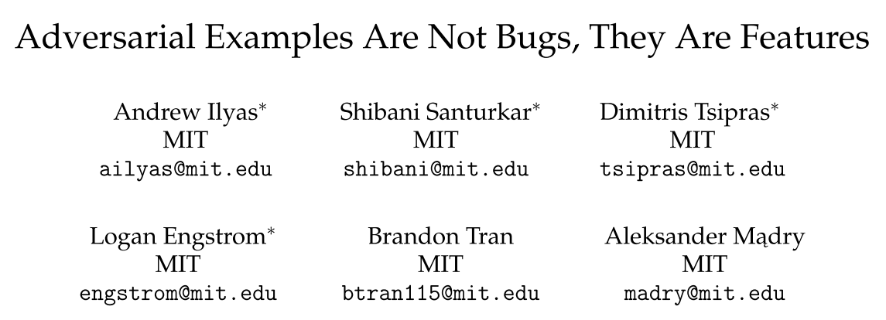
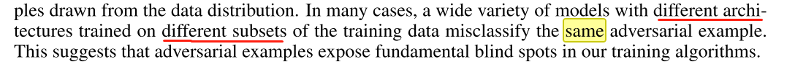
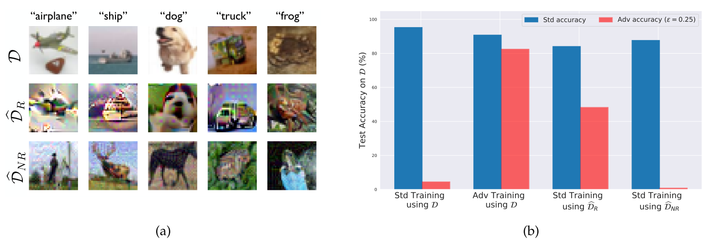
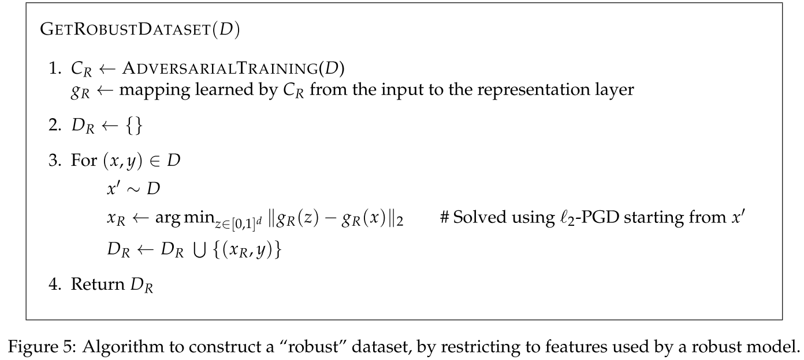
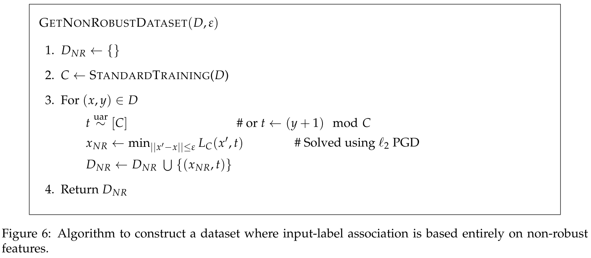

发表于NIPS 2019， [Arxiv](http://arxiv.org/abs/1905.02175)

这组在 神经网络的稳健性上有大量的研究， 来研究下他们的研究品位

# 问题

感觉这篇[知乎回答][1] 讲得很精练。

机器学习易受对抗样本攻击。 但对抗样本的普遍存在性仍是个谜

在 [Explaining and Harnessing Adversarial Examples](http://arxiv.org/abs/1412.6572) 导论第一段就提到了不同网络结构、用不同子集训练，会遇到相同的对抗样本，即对抗样本有迁移性[知乎回答][1].

本文就研究对抗样本和数据本身的相关性

通常，研究人员将对抗样本视作一种错误(aberrations), 由 高维输入空间或训练数据统计上的波动(fluctuations)引起。  由此， 对抗稳健性可以视作一个独立于准确率的优化目标。

# 模型定义

$feature$: 一个函数，将输入$\mathcal{x}->\mathcal{R}$ 映射成一个实数

$\rho$度有用特征， $\gamma$度稳健有用特征，有用不稳健特征——这里“度”是概率， $\mathbb{E}_{(x, y)\sim D}[y \cdot f(x)] \ge \rho$ 

定义一个二分类的分类器$C=(F, w,b)$ 有一个特征集合$F$ ， 预测计算：
$$
C(x) = sign(b + \sum_{f\in F} w_f \cdot f(x))
$$
则分类器$C$ 能学习到的特征集合为 $F_C$ 。 对深度神经网络来说即 倒数第二层（penultimate layer）的激活集合 (即最后全连接层前一层输出) —— 也就是神经网络作为特征提取器再到softmax进行分类，但作者把$F_C$是倒数第二层的激活这句话放到公式(6) 那段去了。

常规训练， 风险最小化ERM(empirical risk minimization)， 对抗稳健训练

# 特征寻找框架

假设原数据集$D$的数据可分解出两种特征数据集， 稳健集$\hat{D_R}$ 和 非稳健集$\hat{D_{NR}}$， 如下图示

怎么找 特征， 基于
$$
\min_{x_r} \|g(x_r) - g(x)\|_2
$$
和
$$
x_{adv} = argmin_{\|x'-x\| \le\epsilon} L_C(x', y)
$$

| 稳健特征 $x_r$                                               | 非稳健特征 $x_{nr}$                                          |
| ------------------------------------------------------------ | ------------------------------------------------------------ |
|  |  |

# 理论分析（下次再说）

# 结论

一篇现象观察、解释的论文，做的分析很多，各种解释，大段文字。只看结论又不算掌握。

对抗脆弱性是因为 监督学习模型敏感于数据泛化良好的特征。

1. 对抗样本是由非稳健特征non-robust features造成的
2. 一个理论框架能发现这些特征
3. 证明了这种特征的广泛存在
4. ？？？这句话好绕

[1]: https://www.zhihu.com/question/323836208/answer/1535946502