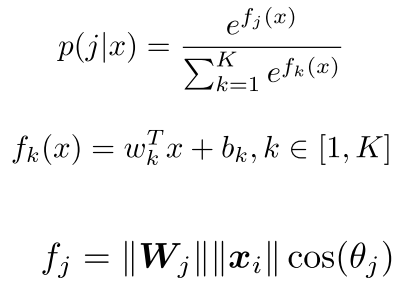
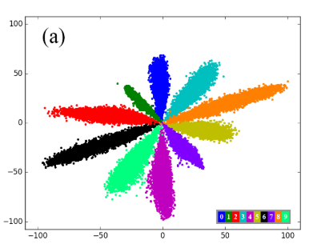
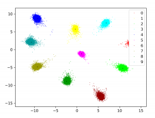
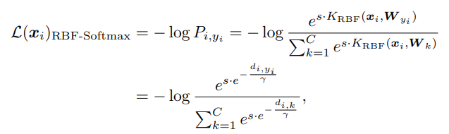
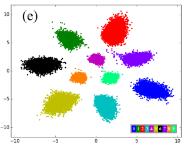
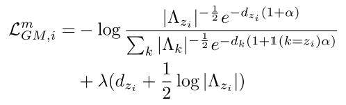

# 原始的softmax和交叉熵CrossEntropy

Softmax使用Boltzmann分布（又名吉布斯分布）

二维时特征分布示意图：

## 怎么改

|                                                              |                                                              |
| ------------------------------------------------------------ | ------------------------------------------------------------ |
| “能给他接的全给他接上， 什么是成功人士你知道吗？” 所以，我们的原则就是：  ！！！能改的都给它改了！！！ |   |

## 这么改

|                                                              |                                                              |
| ------------------------------------------------------------ | ------------------------------------------------------------ |
| 所以，可以从以下角度 1. 分布， 玻尔兹曼分布 -> 高斯分布 2. 距离     2.1 到类中心的距离     2.2 到分类超平面的距离 3. 内积角度 4. 范数， 半径为1的球面 5. 对比的对象，不跟自己其他类的输出值比较了 |   |

# 从内积角度

## 给角度加间隔

论文：Large-Margin Softmax Loss for Convolutional Neural Networks， ICML2016 https://arxiv.org/abs/1612.02295

# 从距离

## 到各个类的中心距离 Center Loss

即L2距离
$$
\mathcal{L}_C = \frac{1}{2} \sum_{i=1}^N \| \bold{x}_{i}-\bold{\mu}_{z_i}\|_{2}^{2}
$$

主要问题是

1. $\mu$ 很容易聚到一起， 所以一般是联合softmax一起使用
2. 没有logits逻辑输出值，没有概率。

论文：A Discriminative Feature Learning Approach for Deep Face Recognition, ECCV 2016 https://link.springer.com/chapter/10.1007/978-3-319-46478-7_31 

## 径向基核距离

[Radial Basis Function](https://en.wikipedia.org/wiki/Radial_basis_function) 
$$
\psi(X) = \psi(\|X - C\|)
$$
本论文里使用的是高斯：
$$
K_{i, j}=K_{\mathrm{RBF}}\left(\boldsymbol{x}_{i}, \boldsymbol{W}_{j}\right)=e^{-\frac{d_{i, j}}{\gamma}}=e^{-\frac{\left\|\boldsymbol{x}_{i}-\boldsymbol{W}_{j}\right\|_{2}^{2}}{\gamma}}
$$

 Radial Basis Function Softmax loss:

这篇论文里，有对softmax不足的分析， [Rethinking Softmax Cross-Entropy Loss for Adversarial Robustness](https://arxiv.org/abs/1905.10626)  也有分析 softmax,  cross-entropy 的不好

论文：RBF-Softmax: Learning Deep Representative Prototypes with Radial Basis Function Softmax, ECCV 2020 https://www.ecva.net/papers/eccv_2020/papers_ECCV/papers/123710290.pdf

# 从分布

# 总结

Github上 PyTorch 实现

https://github.com/YirongMao/softmax_variants