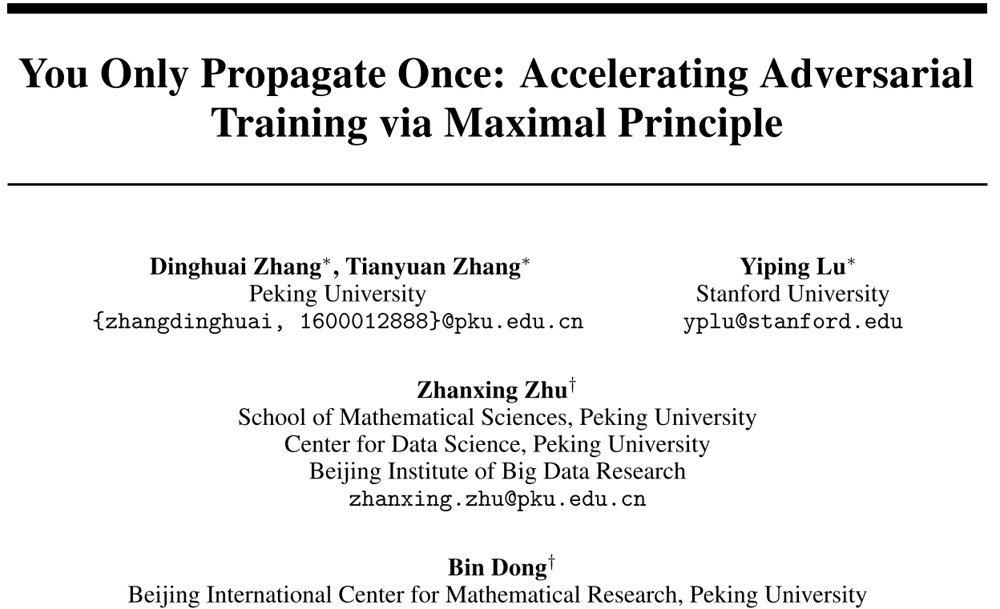
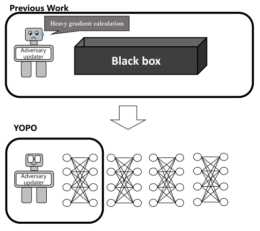
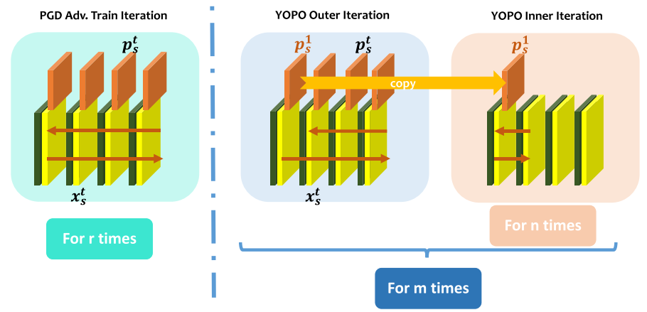
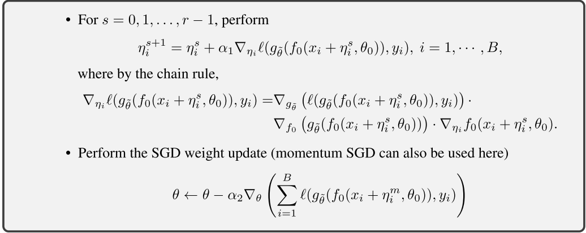
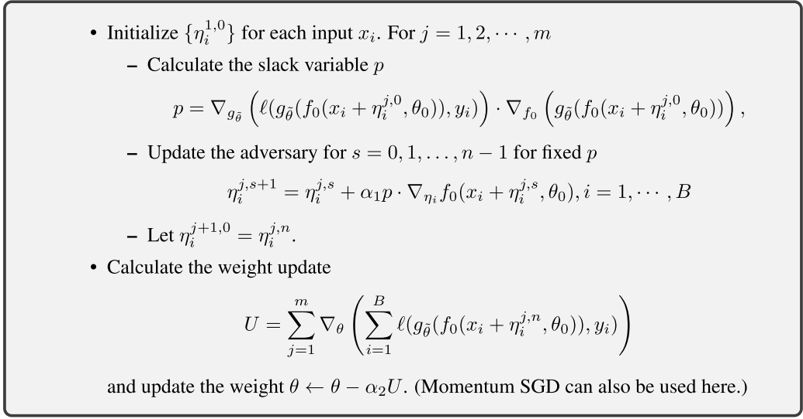
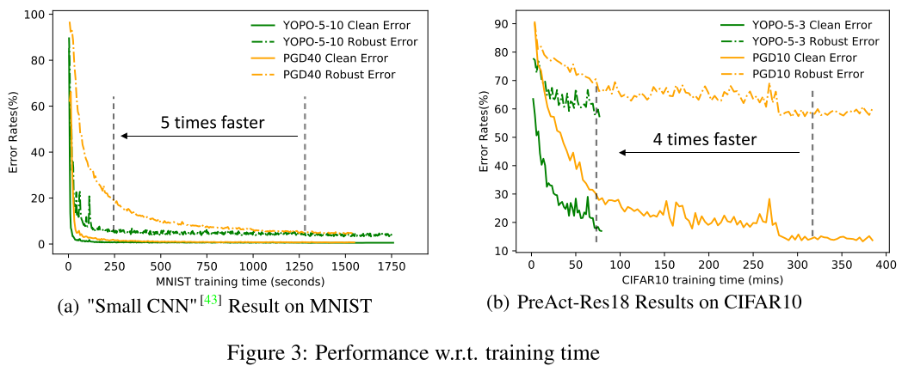
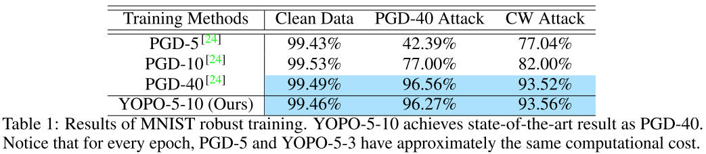
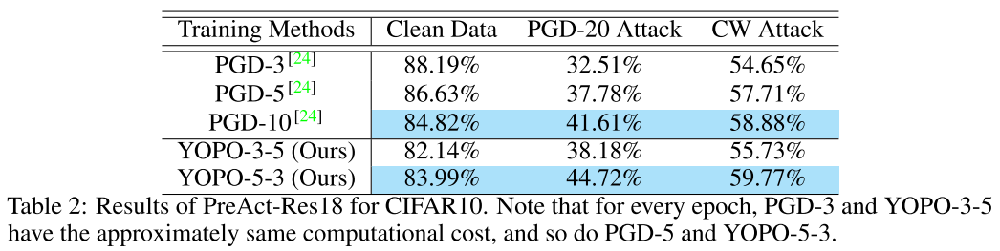
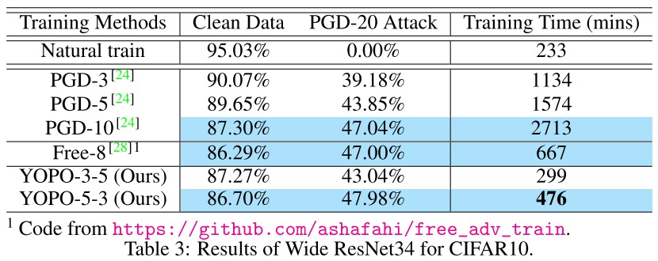
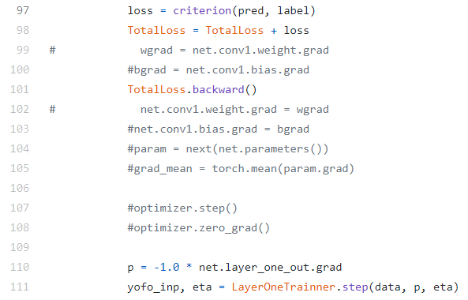

发表于 NIPS 2019, [Arxiv](https://arxiv.org/abs/1905.00877),[Github](https://github.com/a1600012888/YOPO-You-Only-Propagate-Once)

# 问题

1. 神经网络易受攻击， 对抗样本Adversarial Examples、对抗扰动Adversarial Perturbations，非常微小的、人类无法感知的变化，就能骗过神经网络、深度学习
2. 对抗训练Adversarial Training（AT），稳健优化方法，能有效提高网络的稳健程度。
3. 但AT非常费时， FGSM花费时间 是常规训练的两倍， 迭代式的AT方法比如PGD，则是几十倍的时间开销。

所以， 怎么节省AT的训练时间，并且保证不降低稳健性， 就是很值得研究的课题。

## 示意图

假设已知 FGSM([Arxiv](http://arxiv.org/abs/1412.6572), [我的视频](https://www.bilibili.com/video/BV12a4y1J74U)) : 
$$
x + \epsilon sign(\nabla_x L(\theta, x, y))
$$
还有 PGD-K([Arxiv](http://arxiv.org/abs/1706.06083)): 
$$
x^{t+1} = \prod_{x+\mathcal{S}} (x^t + \alpha sign(\nabla_x L(\theta, x, y)))
$$

毫无疑问， 计算量成倍增加。[图片出处](https://mpeker.com/index.php/2019/11/02/visualize-features-of-a-convolutional-neural-network-for-resnet-architecture/)

怎么优化？节省时间？ 从算法角度，不考虑硬件、技巧， 我们也能猜到这篇论文大概是做什么

# 算法角度思考

贪心， 局部优化， 或者从管理学来说

根据链式法则
$$
\begin{align}
\nabla_x L(\theta, x, y) & = \frac{\part L(\theta, x, y)}{\part f(\theta_{1}, x)} \cdot \frac{\part f(\theta_{1}, x)}{\part x} \\
& = \nabla_x (\nabla_f (L(\theta, x, y)) \cdot f(\theta_1, x))
\end{align}
$$

第二行的两项相乘，就是神经网络显然可以固定住第一项，

# 方法

本文是用最优控制optimal control里的最大原则(maximal principle)

对抗训练是个最小最大目标问题 min-max
$$
\min_{\theta} \mathbb{E}_{(x, y)\sim D} \max_{\|\eta\| \le \epsilon} \mathcal{L(\theta; x+\eta, y)}  \tag{1}
$$
本文作者将之转为可导博弈问题 differential game. 接着就可以推导出它的Pontryagin’s Max- imum Principle (PMP) （庞特里亚金最大化原理，变分法中欧拉-拉格朗日方程的特例）

YOPO (You Only Propagate Once)

## 基于梯度的YOPO

重写(1)式， 强调第一层：
$$
\min _{\theta} \max _{\left\|\eta_{i}\right\| \leq \epsilon} \mathcal{L}(\theta; x+\eta, y) =  \sum_{i=1}^{B} \ell (g_{\tilde{\theta}}\left(f_{0}\left(x_{i}+\eta_{i}, \theta_{0}\right)\right), y_{i})  \tag{2}
$$
$f_0$ 代表网络的第一层单元， $g_{\tilde{\theta}} = f_{T-1} \circ \cdots f_1$ 代表了其他层， $B$是批次大小， $\tilde{\theta}$ 就是各层权重 $\{\theta_1,\cdots, \theta_{T-1}\}$

对(2)求导
$$
\nabla_{\eta}\mathcal{L}(\theta; x+\eta, y) = \nabla_{f_0}\mathcal{L}(\theta; x+\eta, y) \cdot \nabla_{\eta} f_0(x + \eta, \theta) \tag{3}
$$

$$

\nabla_{f_0}\mathcal{L}(\theta; x+\eta, y) = \nabla_{g_{\tilde{\theta}}} \ell (g_{\tilde{\theta}}(f_{0}(x_{i}+\eta_{i}, \theta_{0})), y_{i}) \cdot \nabla_{f_0} g_{\tilde{\theta}} (f_{0}(x_{i}+\eta_{i}, \theta_{0}))  = p \tag{4}
$$

叫做松驰变量slack variable. 所以YOPO-m-n 就在内部循环时，固定外部的 $p$。

| PGD-K                                                        | YOPO-m-n                                                     |
| ------------------------------------------------------------ | ------------------------------------------------------------ |
|  |  |

用代码解释下 怎么实现 $\eta^{s+1} = \eta^{s} + \alpha p \cdot \nabla_\eta f_0(x + \eta^s, \theta)$

# 实验结果

我还是不爱讲实验结果

# 源码解释（下次一定）

https://github.com/a1600012888/YOPO-You-Only-Propagate-Once/blob/master/lib/base_model/wide_resnet.py

https://github.com/a1600012888/YOPO-You-Only-Propagate-Once/blob/master/experiments/CIFAR10/wide34.yopo-5-3/training_function.py

# 数学原理（估计下次下篇论文？）
